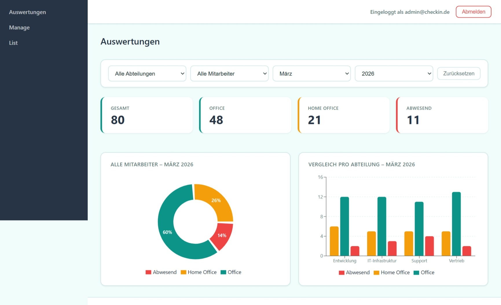

# CheckIn



A full-stack web application for tracking employee attendance with role-based access control, JWT authentication with refresh token rotation, and an analytics dashboard.


## Motivation

CheckIn 2.0 is the continued development of my final IHK apprenticeship project.

The goal was not only to improve the user interface but also to redesign the authentication system, introduce refresh token rotation, improve security, and refactor the overall architecture.

## Features

- **Daily check-in** — employees log their work location each day: Office, Home Office, or Absent (`Abwesend`)
- **Role-based access** — separate views and permissions for admins and employees (`Mitarbeiter`)
- **Secure authentication** — JWT access tokens stored in memory + HttpOnly refresh token cookies (no localStorage)
- **Automatic token refresh** — axios interceptor silently renews expired tokens without interrupting the user
- **Admin dashboard** — attendance statistics and charts, filterable by department (`Abteilung`), employee, month, and year
- **Employee dashboard** — personal attendance history with a yearly overview chart
- **CSV & PDF export** — download filtered attendance records
- **Admin corrections** — admins can retroactively submit a check-in for any employee
- **Email invitations** — new employees receive an email with a one-time link to set their password

---

## German Domain Terms

Since this app was built for a German-speaking workplace, some domain terms appear in the codebase and UI:

| German | English |
|--------|---------|
| Mitarbeiter | Employee |
| Abteilung | Department |
| Abwesend | Absent |
| Einloggen | Log in |
| Abmelden | Log out |
| Auswertungen | Analytics / Reports |
| Einchecken | Check in |
| Nachname / Vorname | Last name / First name |
| Datum | Date |

---

## Tech Stack

### Backend
- ASP.NET Core 8 Web API
- Entity Framework Core with MSSQL (LocalDB for development)
- ASP.NET Core Identity for user management
- JWT Bearer authentication with refresh token rotation
- Roles: `Admin`, `Mitarbeiter` (Employee)

### Frontend
- React 18 with Vite
- Axios with request/response interceptors
- Recharts for data visualization
- react-hot-toast for notifications
- jsPDF + jspdf-autotable for PDF export

---

## Project Structure

```
CheckIn/
├── backend/
│   ├── Controllers/
│   │   ├── AdminController.cs
│   │   ├── AuthController.cs
│   │   ├── CheckInController.cs
│   │   └── UserController.cs
│   ├── Data/
│   │   ├── AppDbContext.cs
│   │   └── SeedData.cs
│   ├── Dto/
│   │   ├── AuthResponseDto.cs
│   │   ├── CheckInDto.cs
│   │   ├── CheckInExportDto.cs
│   │   ├── CheckInListDto.cs
│   │   ├── CheckInStatsDto.cs
│   │   ├── CheckInStatusDto.cs
│   │   ├── CreateUserDto.cs
│   │   ├── InviteUserDto.cs
│   │   ├── AbteilungStatsDto.cs
│   │   ├── LoginDto.cs
│   │   ├── SetPasswordDto.cs
│   │   └── UserDto.cs
│   ├── Models/
│   │   ├── AttendanceStatus.cs
│   │   ├── CheckIn.cs
│   │   ├── JwtSettings.cs
│   │   ├── RefreshToken.cs
│   │   └── User.cs
│   ├── Services/
│   │   ├── AuthService.cs
│   │   ├── CheckInService.cs
│   │   ├── EmailService.cs
│   │   ├── IAuthService.cs
│   │   ├── ICheckInService.cs
│   │   ├── IEmailService.cs
│   │   ├── IInvitationService.cs
│   │   ├── IUserService.cs
│   │   ├── InvitationService.cs
│   │   └── UserService.cs
│   └── Program.cs
└── frontend/
    ├── src/
    │   ├── api/
    │   │   └── api.jsx
    │   ├── assets/
    │   ├── components/
    │   │   ├── Button.jsx
    │   │   ├── DateTime.jsx
    │   │   ├── ExportTable.jsx
    │   │   ├── Navbar.jsx
    │   │   ├── StatCard.jsx
    │   │   └── Toast.jsx
    │   ├── contexts/
    │   │   └── AuthContext.jsx
    │   ├── pages/
    │   │   ├── AdminList.jsx
    │   │   ├── AdminManage.jsx
    │   │   ├── AdminPanel.jsx
    │   │   ├── CheckInPage.jsx
    │   │   ├── Dashboard.jsx
    │   │   ├── Login.jsx
    │   │   ├── Unauthorized.jsx
    │   │   └── UserView.jsx
    │   ├── routes/
    │   │   └── ProtectedRoute.jsx
    │   ├── styles/
    │   │   ├── App.css
    │   │   ├── components.css
    │   │   ├── dashboard.css
    │   │   ├── index.css
    │   │   └── pages.css
    │   └── main.jsx
    └── vite.config.js
```

---

## Getting Started

### Prerequisites

- [.NET 8 SDK](https://dotnet.microsoft.com/download)
- [Node.js 18+](https://nodejs.org/)
- SQL Server LocalDB (included with Visual Studio) or a full SQL Server instance

### Backend

```bash
cd backend

# Restore packages
dotnet restore

# Apply migrations and create the database
dotnet ef database update

# Start the API — runs on https://localhost:7005
dotnet run
```

The first run automatically seeds the database with an admin account and sample employees.

**Default credentials:**

| Role | Email | Password |
|------|-------|----------|
| Admin | admin@checkin.de | Admin123! |
| Mitarbeiter (Employee) | l.mueller@checkin.de | Passwort123! |

### Frontend

```bash
cd frontend

# Install dependencies
npm install

# Start the dev server — runs on http://localhost:5173
npm run dev
```

---

## Authentication Flow

```
Login
  └─► Access Token (in-memory)  +  Refresh Token (HttpOnly Cookie)
              │
              ▼
       API request with Bearer token
              │
         401 Unauthorized?
              │
              ▼
       POST /api/Auth/refresh  ← cookie sent automatically by browser
              │
              ▼
       New Access Token → original request retried
              │
         Refresh failed?
              │
              ▼
       Forced logout → redirect to /login
```

- **Access tokens** expire after 15 minutes and are never written to `localStorage` or `sessionStorage`
- **Refresh tokens** are valid for 7 days, rotated on every use, and stored as `HttpOnly; Secure; SameSite=None` cookies — inaccessible to JavaScript

---

## API Endpoints

### Auth

| Method | Endpoint | Auth | Description |
|--------|----------|------|-------------|
| POST | `/api/Auth/login` | Public | Login, returns access token + sets refresh cookie |
| POST | `/api/Auth/refresh` | Public | Issue new access token using HttpOnly cookie |
| POST | `/api/Auth/logout` | Public | Revoke refresh token and clear cookie |
| POST | `/api/Auth/set-password` | Public | Set password via invitation token |

### CheckIn (Mitarbeiter / Employee)

| Method | Endpoint | Description |
|--------|----------|-------------|
| POST | `/api/CheckIn/set-status` | Submit today's attendance status |
| GET | `/api/CheckIn/checkin` | Get current check-in status |
| GET | `/api/CheckIn/stats/me` | Get personal attendance statistics |

### User (Admin only)

| Method | Endpoint | Description |
|--------|----------|-------------|
| GET | `/api/User` | List all users |
| GET | `/api/User/{id}` | Get user by ID |
| GET | `/api/User/stats` | Attendance statistics with filters |
| GET | `/api/User/stats/abteilungen` | Statistics grouped by department |
| POST | `/api/User/{userId}/checkin` | Retroactive check-in for an employee |
| GET | `/api/User/export` | Export attendance data (CSV/PDF rendered in frontend) |

### Admin

| Method | Endpoint | Description |
|--------|----------|-------------|
| POST | `/api/Admin/invite` | Send invitation email to a new employee |

---

## Configuration

`backend/appsettings.json`:

```json
{
  "ConnectionStrings": {
    "DefaultConnection": "Server=(localdb)\\mssqllocaldb;Database=CheckInApiDb;Trusted_Connection=True;"
  },
  "Jwt": {
    "Key": "your-secret-key-minimum-32-characters",
    "Issuer": "CheckInAPI",
    "Audience": "CheckInUsers",
    "ExpiresInMinutes": 15
  },
  "Frontend": {
    "Url": "http://localhost:5173"
  },
  "Smtp": {
    "Host": "smtp.example.com",
    "Port": "587",
    "Username": "your@email.com",
    "Password": "your-password",
    "From": "noreply@checkin.de"
  }
}
```

## License

This project is licensed under the MIT License.